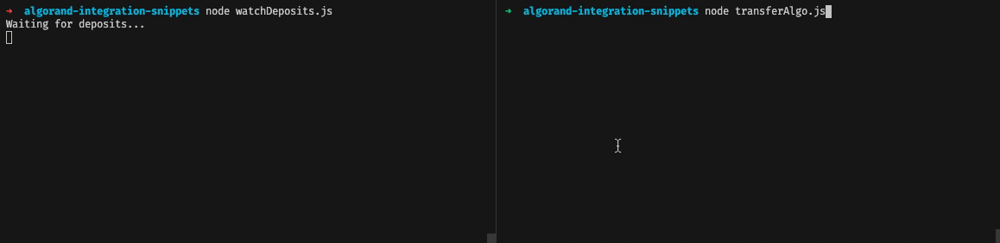

# Algorand Integration Snippets

JavaScript code snippets illustrating basic integration operations with Algorand.

This is a companion repository to the article: [Integrating with third-party app (deposits and withdrawals)](https://developer.algorand.org/tutorials/how-to-integrate-with-algorand/) on the Algorand Developer portal.

## Prerequisites

[Algorand Sandbox](https://github.com/algorand/sandbox#readme) must be up and running in the _Private network_ mode (default one) prior to starting this app.
Please refer to the Sandbox documentation to find the most relevant information on how to download and start it.

For the best experience it is recommended to reset the Sandbox to its initial state by running the following command in the Sandbox directory:

```bash
./sandbox reset
```

## How to use snippets

For the best learning experience, it is recommended to run snippets in the following sequence. This ensures that everything works as expected.

### 1. Generate account

Learn how to generate a standalone account on Algorand.

```bash
node generateAccount.js
```

### 2. Generate accounts using KMD

Learn how to create a deterministic wallet and generate a repeatable set of addresses using only one key.

```bash
node generateAccountsUsingKmd.js
```

### 3. Transfer Algo

Learn how to make a basic transaction for transfer Algo.

```bash
node transferAlgo.js
```

### 4. Checking minimum balance

Learn how to check the expected account balance before the transaction to ensure it satisfies minimum amount requirements.

```bash
node checkAccountBalance.js
```

### 5. Opt-in for an Algorand Standard Asset (ASA)

Learn the peculiarities of working with Algorand Standard Assets (ASA). Make the newly created account be able to receive an ASA.

```bash
node optInASA.js
```

### 6. Transfer ASA

Learn how to transfer an Algorand Standard Asset (ASA).

```bash
node transferASA.js
```

### 7. Watch for deposits

Learn how to implement watching for new deposits and emit appropriate events. See `DepostiWatcher.js`.

```bash
node watchDeposits.js
```



## See also

A sample app able to create deposit addresses and watch for deposits: https://github.com/bakoushin/algorand-deposit-example

## Author

Alex Bakoushin

## License

MIT
